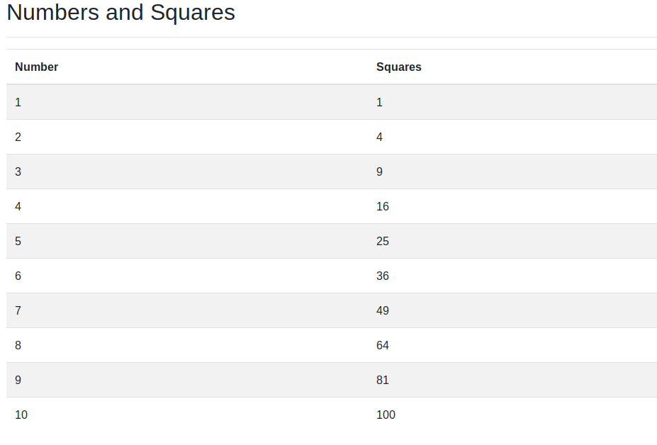
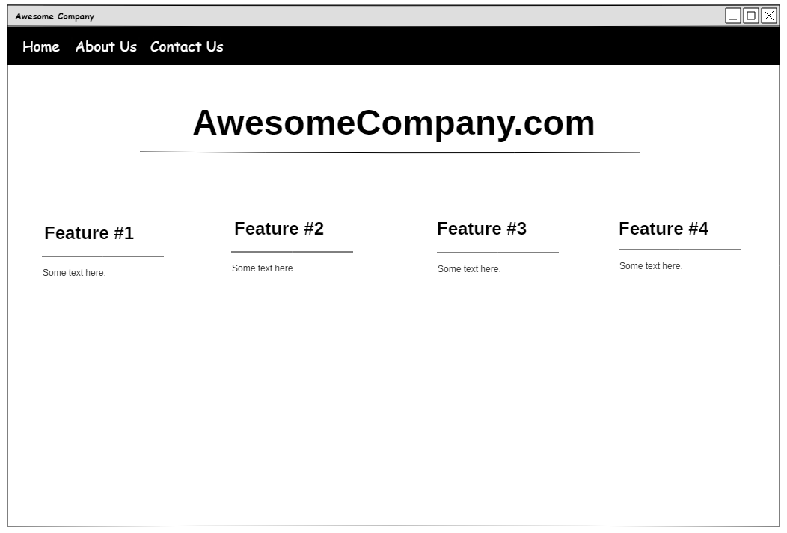
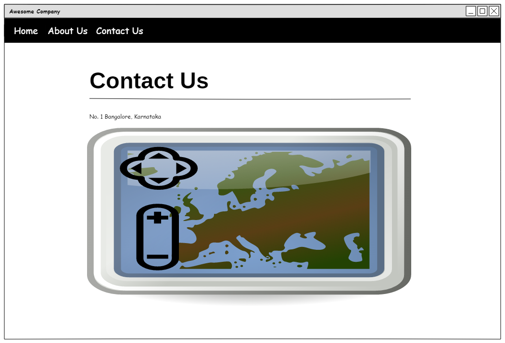

# Week 1 Assignments

## Day 1
#### Create an HTML page on [codepen.io](https://codepen.io) using the tags learnt

## Day 2
#### Create an HTML page on [codepen.io](https://codepen.io) using 5 block and inline elements each

# Week 2 Assignments

## Day 1
#### Fork attainu-falcon repo, commit and issue a pull request.
1. Signup for a github.com account
2. Fork [https://github.com/attainu-falcon/attainu-falcon](https://github.com/attainu-falcon/attainu-falcon)
3. Create a file named `why_i_want_to_be_a_programmer.txt` inside the `assignments` folder.
4. Write a short note in the file why you want to be a programmer? :)

## Day 2
#### Pull updates from this repo, commit and issue a pull request.
1. Add upstream url to your remote.
2. Create a folder called `HTML` inside the `assignments` folder.
3. Create 2 empty files named `first.html` and `second.html` inside the above `HTML` folder.
4. Copy the code from your 2 codepen assignments into the respective files.

## Day 3
#### Create a new git repo, create a file and pull it into your forked `attainu-falcon` repo.
1. Name the new repo 'HelloWorld'.
2. Create a folder called `assignments` inside this repo.
3. Create a blank file named `helloworld.txt` inside the `assignments` folder.
4. Go to your forked `attainu-falcon` repo and add remote url of this new repo.
5. Pull changes from the remote to your forked repo.

## Day 4
#### Create an "About Me" web page (html and css)
1. Pull changes into your repo.
2. Create a folder named `AboutMe` inside the `assignments` folder.
3. Inside the above folder, create a page about you with `html` and `css` having:
    1. A heading with your name.
    2. A short paragraph about you.
    3. A list of your favourite movies.

## Day 5
#### Create a web-mail page

1. Pull changes into your repo.
2. Create a folder named `WebMail` inside the `assignments` folder.
3. Inside the above folder, create a web-mail page which has three sections:
    1. The left one is for navigation and contains links for Inbox, Sent, Drafts & Trash. You can use an un-ordered list to do that.
    2. The right box is a table of emails with coloumns for From, Subject & Date.
    3. The bottom one is for placing ads.
4. You can use sizes, colors, font etc according to your choice.

# Week 3 Assignments

## Day 1
#### Create a shopping page

1. Pull changes into your repo.
2. Create a folder named `MyShop` inside the `assignments` folder.
3. Inside the above folder, create a page which has these sections:
    1. The header at the top is fixed and does not hide on scroll.
    2. The next one is for navigation and contains links for categories and a search box. You can use an un-ordered list to do that. This is also fixed and does not hide on scroll.
    3. On the left we have a sidebar for filters. It has checkboxes
    4. On the right is the product catalogue including price and other details.
    5. You have a select dropdown for the 'Sort By' option.
4. This is an assignment where you are required to build to given specifications.

# Week 4 Assignments

## Day 1

#### Write a Javascript program that prints multiplication table of `n` upto 10.
1. Put your codes inside a `MultiplyJS` folder under `assignments`.
2. `n` should be entered in a input of type `number`.
3. There should be a button with text 'Print Multiplication Table', when clicked should show the output in the following format (assuming n is 5):
```
1 * 5 = 5
2 * 5 = 10
.
.
.
10 * 5 = 50
```

## Day 3

#### Create a simple calculator using JS with the UI looking like the below image:

1. Put your codes inside a `CalculatorJS` folder under `assignments`. 
2. Use inputs of type `number`.
3. Use functions as and when necessary.

# Week 5 Assignments

## Day 2

#### Create a Javascript program that produces a table of numbers from 1 to 10 and squares of them:



1. Put your codes inside a `ManipulationJS` folder under `assignments`. 
2. Use DOM manipulation to create all the HTML elements. That is the HTML should only contain a `body` tag.

## Day 3

#### Create a login page that checks for username and password from the user:

1. Put your codes inside a `LoginJS` folder under `assignments`.
2. Validate the inputs:
    1. Username or password cannot be blank.
    2. Username cannot be less than 5 characters.
    3. Password cannot be less than 8 characters.
    4. Username can only contain alphabets, digits and `_`.
    5. Username cannot start with a digit.
    6. Username should be case-insensitive.
3. Username and password can be hardcoded in the JavaScript file.

# Week 6 Assignments

## Day 1

#### Duplicate and modify previous assignment using a bootstrap template.
1. Put your codes inside a `LoginBS` folder under `assignments`.
2. The template can be found at [https://getbootstrap.com/docs/4.3/examples/sign-in/](https://getbootstrap.com/docs/4.3/examples/sign-in/).
3. Look at the page source and try to get the UI as close as possible.

## Day 2

#### Create a company web page using Bootstrap 4.

Home page

About Us page

Contact Us page


1. Put your codes inside a `CompanyBS` folder under `assignments`.
2. Use documentation at [https://getbootstrap.com/](https://getbootstrap.com/) for help.
3. Do not use any custom css styles.
4. You are free to replace text content in the pictures.

## Day 4

#### Create an Express application with the following features:
1. The application should have four routes that perform addition, subtraction, multiplication and division.
2. The add route should take two url parameters and send back their sum.
3. The sub route should take two url parameters and send back their difference.
4. The mul route should take two url parameters and send back their product.
5. The div route should take two url parameters and send back their division result.
6. Put your files inside a `Express_Calculator` folder under `assignments`.

# Week 6 Assignments

## Day 1

#### Create a REST API calculator using Express
1. Create four routes in Express for add, sub, mul and div.
2. Each route should take two POST data parameters - `num1` and `num2` in JSON format and do the arithmetic operation on them.
3. For instance, the response for the add route should look like the following:
```
{
    "num1": 20,
    "num2": 50,
    "result": 70
}
```
4. No need for UI. Everything can be tested using Postman.
5.  Put your files inside a `Express_RESTful` folder under `assignments`.
