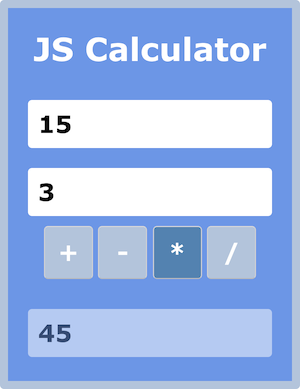
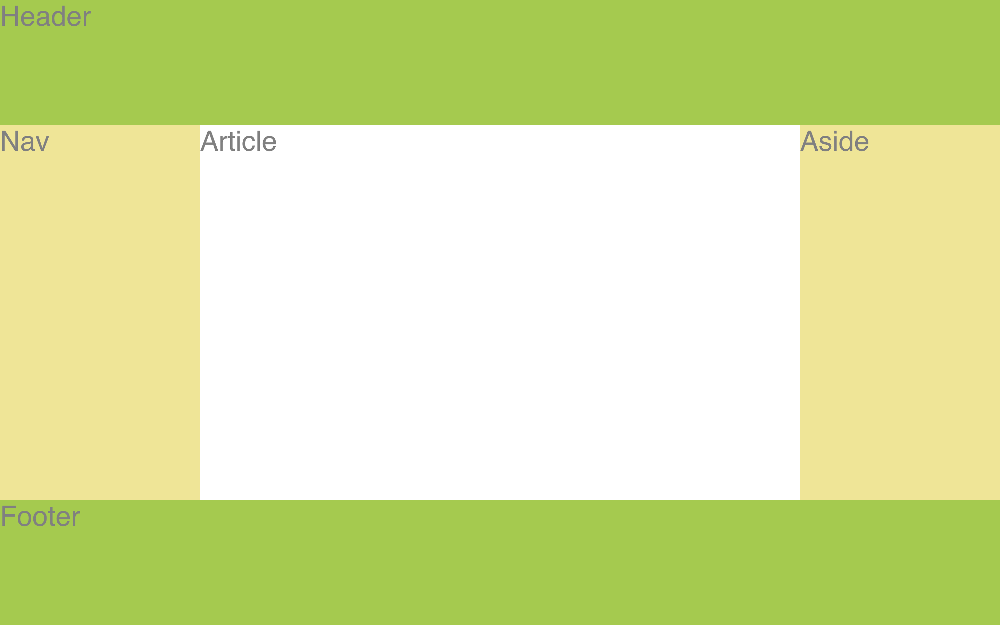
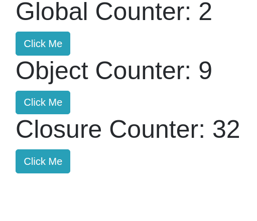
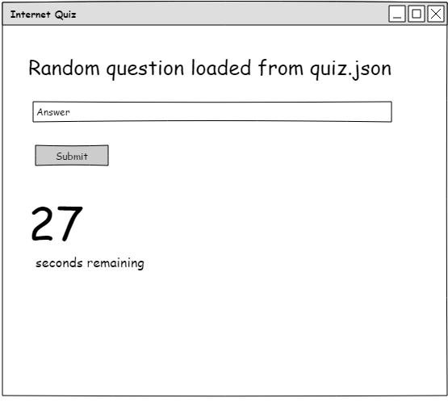
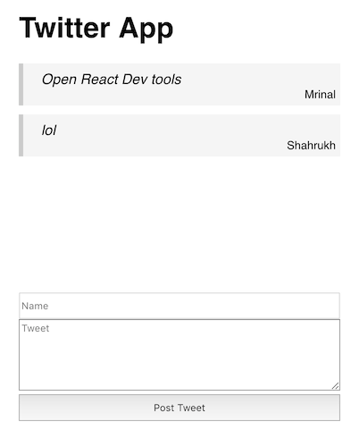
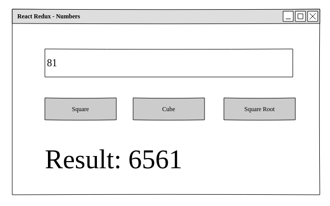

# List of Assignments

## Week 1

### Day 1: Create an HTML page on [codepen.io](https://codepen.io) using the tags learnt

### Day 2: Create an HTML page on [codepen.io](https://codepen.io) using 5 block and inline elements each

----------
## Week 2

### Day 1: Fork attainu-falcon repo, commit and issue a pull request.

1. Signup for a github.com account
2. Fork [https://github.com/attainu-falcon/attainu-falcon](https://github.com/attainu-falcon/attainu-falcon)
3. Create a file named `why_i_want_to_be_a_programmer.txt` inside the `assignments` folder.
4. Write a short note in the file why you want to be a programmer? :)

### Day 2: Pull updates from this repo, commit and issue a pull request.

1. Add upstream url to your remote.
2. Create a folder called `HTML` inside the `assignments` folder.
3. Create 2 empty files named `first.html` and `second.html` inside the above `HTML` folder.
4. Copy the code from your 2 codepen assignments into the respective files.

### Day 3: Create a new git repo, create a file and pull it into your forked `attainu-falcon` repo.

1. Name the new repo 'HelloWorld'.
2. Create a folder called `assignments` inside this repo.
3. Create a blank file named `helloworld.txt` inside the `assignments` folder.
4. Go to your forked `attainu-falcon` repo and add remote url of this new repo.
5. Pull changes from the remote to your forked repo.

### Day 4: Create an "About Me" web page (html and css)

1. Pull changes into your repo.
2. Create a folder named `AboutMe` inside the `assignments` folder.
3. Inside the above folder, create a page about you with `html` and `css` having:
    1. A heading with your name.
    2. A short paragraph about you.
    3. A list of your favourite movies.

### Day 5: Create a web-mail page


1. Pull changes into your repo.
2. Create a folder named `WebMail` inside the `assignments` folder.
3. Inside the above folder, create a web-mail page which has three sections:
    1. The left one is for navigation and contains links for Inbox, Sent, Drafts & Trash. You can use an un-ordered list to do that.
    2. The right box is a table of emails with coloumns for From, Subject & Date.
    3. The bottom one is for placing ads.
4. You can use sizes, colors, font etc according to your choice.

----------
## Week 3

### Day 1: Create a shopping page


1. Pull changes into your repo.
2. Create a folder named `MyShop` inside the `assignments` folder.
3. Inside the above folder, create a page which has these sections:
    1. The header at the top is fixed and does not hide on scroll.
    2. The next one is for navigation and contains links for categories and a search box. You can use an un-ordered list to do that. This is also fixed and does not hide on scroll.
    3. On the left we have a sidebar for filters. It has checkboxes
    4. On the right is the product catalogue including price and other details.
    5. You have a select dropdown for the 'Sort By' option.
4. This is an assignment where you are required to build to given specifications.

----------
## Week 4

### Day 1: Write a Javascript program that prints multiplication table of `n` upto 10.

1. Put your codes inside a `MultiplyJS` folder under `assignments`.
2. `n` should be entered in a input of type `number`.
3. There should be a button with text 'Print Multiplication Table', when clicked should show the output in the following format (assuming n is 5):
```
1 * 5 = 5
2 * 5 = 10
.
.
.
10 * 5 = 50
```

### Day 3: Create a simple calculator using JS with the UI looking like the below image:


1. Put your codes inside a `CalculatorJS` folder under `assignments`. 
2. Use inputs of type `number`.
3. Use functions as and when necessary.

----------
## Week 5

### Day 2: Create a Javascript program that produces a table of numbers from 1 to 10 and squares of them:


1. Put your codes inside a `ManipulationJS` folder under `assignments`. 
2. Use DOM manipulation to create all the HTML elements. That is the HTML should only contain a `body` tag.

### Day 3: Create a login page that checks for username and password from the user:


1. Put your codes inside a `LoginJS` folder under `assignments`.
2. Validate the inputs:
    1. Username or password cannot be blank.
    2. Username cannot be less than 5 characters.
    3. Password cannot be less than 8 characters.
    4. Username can only contain alphabets, digits and `_`.
    5. Username cannot start with a digit.
    6. Username should be case-insensitive.
3. Username and password can be hardcoded in the JavaScript file.

----------
# Week 6

### Day 1: Duplicate and modify previous assignment using a bootstrap template.
1. Put your codes inside a `LoginBS` folder under `assignments`.
2. The template can be found at [https://getbootstrap.com/docs/4.3/examples/sign-in/](https://getbootstrap.com/docs/4.3/examples/sign-in/).
3. Look at the page source and try to get the UI as close as possible.

### Day 2: Create a company web page using Bootstrap 4.
Home page

About Us page

Contact Us page


1. Put your codes inside a `CompanyBS` folder under `assignments`.
2. Use documentation at [https://getbootstrap.com/](https://getbootstrap.com/) for help.
3. Do not use any custom css styles.
4. You are free to replace text content in the pictures.

### Day 4: Create an Express application with the following features:

1. The application should have four routes that perform addition, subtraction, multiplication and division.
2. The add route should take two url parameters and send back their sum.
3. The sub route should take two url parameters and send back their difference.
4. The mul route should take two url parameters and send back their product.
5. The div route should take two url parameters and send back their division result.
6. Put your files inside a `Express_Calculator` folder under `assignments`.

----------
## Week 7

### Day 1: Create a REST API calculator using Express

1. Create four routes in Express for add, sub, mul and div.
2. Each route should take two POST data parameters - `num1` and `num2` in JSON format and do the arithmetic operation on them.
3. For instance, the response for the add route should look like the following:
```
{
    "num1": 20,
    "num2": 50,
    "result": 70
}
```
4. No need for UI. Everything can be tested using Postman.
5. Put your files inside an `Express_RESTful` folder under `assignments`.

### Day 3: Create a login portal in Express with the following components (as shown in yesterday's lecture):

1. A _students.json_ which stores data for students including their `username` and `password`.
2. A _login_ form as created in a previous assignment (LoginJS, LoginBS).
3. An _authentication_ route which uses a students.json to verify login.
4. A _redirection_ route only visible after successful login. You can use the webmail assignment as this protected route.
5. A _logout_ route to destroy the session.
6. Put your files inside an `Express_Session` folder under `assignments`.

### Day 5: Create an Express application which has the following features:
1. Store a set of name and tweet data in a variable in Express.
    ```
    var tweets = [
        {
            name: "digitizer",
            tweet: "This is a cool piece of information."
        },
        {
            name: "M0SH",
            tweet: "@digitizer I agree."
        }
    ]
    ```
2. A default route which displays this data in the UI.
3. This page displays a form - a _name_ input, a _tweet_ input and a _submit_ button at the end.
4. The same route should be the form action handler for the POST request on the submit button. You can post data directly as urlencoded or use JavaScript to post it as JSON.
4. Update the data variable in Express on a successful POST request.
5. Also, update the UI to reflect the new tweets that have been posted.
6. Put your files inside an `Express_Twitter` folder under `assignments`.

----------
## Week 8

### Day 2: Create an Express application which has the following features:

1. Make a copy of the above assignment and modify the code to use data from a `tweets` collection in a database stored on a MongoDB server.
2. The new tweet from the form should update this database collection.
3. The UI should reflect the updates in the database collection.
4. Put your files inside an `Express_MongoDB` folder under `assignments`.

### Day 5: Create an Express application which has the following features:

1. Create a database for AttainU with collections of students and instructors (name, email, phone, age, etc.).
2. Create CRUD routes to add, get, modify and delete student documents.
3. Create a view at `/instructors` to show all instructor information as bootstrap cards.
4. Create a separate view at `/students` to show all student information as bootstrap cards.
5. On the student card have an `Edit` option which turns information to input boxes and an option to `Save`.
6. Create a view at `/students/add` with a form to add a new student to the collection.
7. Also have a `Delete` option.
8. Put your files inside an `Express_AttainU` folder under `assignments`.

----------
## Week 12

### Day 2: Create a flexbox webpage


1. Use semantic HTML elements only.
2. Use CSS flexbox layout to achieve the layout shown in the image.
3. Put your files under `assignments` > `week12` > `day02`.
4. Move all other assignments under `assignments` > `shallow-dive`.

> Solution session: _day-0_
>
> Due day: _day-0_

### Weekly Test: Globals, Objects & Closures


1. Clicking on each button should update the counter about it.
2. For `Global Counter` use a global variable to keep track of the clicks.
3. For `Object Counter`, use an object to keep track of the clicks.
4. And finally for `Closure Counter`, use a closure to keep track of the clicks.
5. You can use either Vanialla JS + DOM methods or jQuery for event handlers.
6. Put your files under `assignments` > `week12` > `weekly-test`.

> Due day: _day-3_

----------
## Week 13

### Day 1: Classes and constructors

1. The assignment is to create a Javascript class called `MyArray` making use of a constructor to initialize a property named `array`.
2. The constructor should take arguments passed to it as the initial elements of array, like `MyArray(5, 2, 6, 4, 3, 1)`.
3. The object should have three methods:
    1. `print()` - Prints the content of the array to console.
    2. `search(searchValue)` - Searches the passed element in the array and returns the index if found. If not found, returns `-1`.
    3. `sort()` - Sorts the array in descending order. No need to use any sorting algorithm. Use JS array methods to implement the same. 

> **Note:** JS arrays sort alphabetically as strings by default. [Reference](https://www.w3schools.com/js/js_array_sort.asp)

> Due day: _day-0_

### Day 2: Functional Programming

Consider this array -
`var numbers = [4, 28, 43, 34, 37, 41, 26, 49, 33, 19, 36, 25, 47, 20, 1, 45, 6, 5, 27, 48];`

Write a program that generates an array of squares of only even numbers from the above array.

The output should be -
`[ 16, 784, 1156, 676, 1296, 400, 36, 2304 ]`

And you have to write the logic in both imperative style and functional style.

> Due day: _day-1_

### Weekly Test: Pokemon Game

1. Generate 5 two-digit random numbers between 1 and 100.
2. For each of the numbers generated call the api, `https://pokeapi.co/api/v2/pokemon/xx` (`xx` being the two-digit number).
3. The result of this api call, will give you the `height` property which is an integer.
4. Add `height` for all the 5 pokemons. If this sum is an even number, resolve the promise alerting this sum.
5. If sum is an odd number, reject the promise alerting this sum.
6. Put your files under `assignments` > `week13` > `weekly-test`.

**Hint:** Use `Math.random()` to generate random numbers.

> Due day: _day-3_

----------
## Week 14

### Day 1: First React app

1. Use the timer example at https://reactjs.org/ and modify it to tick at every 100 millisecond.
0.0, 0.1, 0.2 -> ... 
2. Add this .jsx code to an npm project. [Reference](https://reactjs.org/docs/add-react-to-a-website.html#add-jsx-to-a-project)
3. Use `npx` commands to compile .jsx to js.
4. Use the compiled file as a script in your html file.
5. Give the html an `h1` of 'React 100ms Counter'.
6. Put your files under `assignments` > `week14` > `day01`.

**Hint:** Use `number.toFixed()` to display `45` as `45.0`. [Reference](https://www.w3schools.com/jsref/jsref_tofixed.asp)

> Due day: _day-0_

### Day 2: React login form

1. Create a `LoginForm` component that renders two inputs and a button.
2. Break down into as many components as you can.
3. Use `npx` commands to compile .jsx to js.
4. Use the compiled file as a script in your html file.
5. Put your files under `assignments` > `week14` > `day02`.

> Due day: _day-0_

### Day 4: React calculator

We have created a simple calculator using JavaScript before.

Now let's create the same one using React.
All the arithmetic operations should be implemented using functions.

> Due day: _day-0_

### Weekly Test: Quiz app


Create a React app which loads a question from the [quiz.json](data/quiz.json) file. You can store the json as in a variable in your component.

On clicking the submit button, the app should show the next question and keep a track of the number of questions that have been answered correctly.

Also present is a timer component which ticks every second for 60 seconds. Once the timer shuts down or if all the 10 questions are answered, the app should display the score for the user.

> Due day: _day-3_

----------
## Week 15

### Day 2: Bootstrap company website in React

Create the following pages in React:

Home

About Us page

Contact Us page


1. For this assignment, the pages will be written as React components.
2. You are free to divide each page into as many components you wish.
3. You need to use the `react-dom-router` package for routing/linking the pages.
4. Put your files under `assignments` > `week15` > `day02`.

> Due day: _day-0_

### Day 4: Calendar component

Create a calendar component in React which,
1. Consists of an input element.
2. Creates a table of dates for the month of August 2019 on focusing on this element.
3. On clicking any date in the calendar the input box should update the value to the selected date in the format `dd.mm.yy`.
5. Put your files under `assignments` > `week15` > `day04`.

> Due day: _day-1_

### Weekly Test: Webmail with React

Create a webmail app in React which,
1. Create the webmail app with navigation component on the left (Inbox, Sent, Drafts, Trash).
2. On clicking each of these render the component with list of mails in that category.
3. The above component gets the category as its prop and filters mails accordingly.
4. Use [mail.json](data/mail.json) to fetch relevant data.
5. Put your files under `assignments` > `week15` > `weekly-test`.

> Due day: _day-3_

----------
## Week 16

### Day 3: Simple Redux store

Create a Redux store and reducer with the following initial state :

```
currentScore: 0
```

The reducer should accept the following actions - 

```
UPDATE_BONUS
LEVEL_COMPLETED
LIFE_LOST
```

`UPDATE_BONUS` should increment the `currentScore` by 100
`LEVEL_COMPLETED` should increment the `currentScore` by 500
`LIFE_LOST` should decrement the `currentScore` by 250

> Due day: _day-1_

### Weekly Test: Twitter with Redux


Modify the Twitter app in React to use Redux.

Have the same 3 components: `TweetContainer`, `Tweet`, `TweetForm`

Posting a new tweet should dispatch an action to update the global store.

----------
## Week 18

### Day 3: React Redux - Numbers


Lets create a React + Redux app similar to the attached picture.

As you can see, an user can enter a number and click on three buttons which will generate square or cube or square root depending on the button pressed.

Here are the requirements

1. Use Redux store to manage your application state.
2. Use ES6 modules to split your app into multiple components and store.

Have at least four separate components - `Input`, `SquareButton`, `CubeButton`, `SquareRootButton` in different files and import all of them in `App.js` and then finally render them inside `index.js`.

Put your files like discussed for better review.
1. action creators -> inside `actions` folder
2. reducers -> inside `reducers` folder
3. store -> in a `store.js` file

**Hint:** The first step should be to divide the task into appropriate number of reducers and actions. This app can be done with single reducer containing 3 actions.

### Day 4: React Redux - Colors

1. Adding to the same assignment above, create 3 more components - `RedButton`, `GreenButton`, `BlueButton`.
2. Display these buttons on the same page as previous, below the existing buttons.
3. On clicking on any of these, dispatch actions to a `colorReducer` to update the color code in the store.
4. Use this state variable to set the `input -> backgroundColor` in the Input component. Use inline styling.

### Weekly Test:


1. Create an app in React + Redux with 3 components - App, UserList and RepoList.
2. Fetch a list of users from `https://api.github.com/users` and display in UserList like shown.
3. On clicking the `Show repos` button on any user card, fetch the list of repos for the user and display in `RepoList`.
eg, `https://api.github.com/users/defunkt/repos`
4. There will be two reducers each for fetching `users` and `repos`.

----------
## Week 19

### Day 1: React Redux - Webmail
Create a webmail app in React + Redux which,
1. Displays a navigation component on the left (Inbox, Sent, Drafts, Trash).
2. On clicking any of these render the component with list of mails in that category.
3. This component dispatches the corresponding action + a payload of filtered mails to the reducer.
4. Use [mail.json](data/mail.json) to fetch relevant data.
5. Put your files under `assignments` > `week19` > `day01`.

> Due day: _day-1_

### Day 2: React Redux - Webmail
Modify the webmail app in React + Redux to,
1. Show a checkbox beside the mail.
2. On clicking on it, mark that mail as read.
3. Unselecting the checkbox should mark it as unread again.
4. This component dispatches the corresponding action to the store to update the corresponding mail object to add a new key `read: true`.
5. On the initial load, the key would not exist, which should be taken as an unread mail.

> Due day: _day-1_
